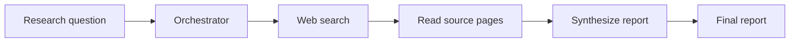

# AI Research Assistant

An interactive command-line research assistant that turns a question into focused research tasks, searches the web for sources, reads and summarizes source pages, and synthesizes the findings into a concise report.

## How it works

The application runs a linear workflow using LangGraph:



1. **Orchestrator** uses Groq's OpenAI-compatible API and a structured output schema to divide the question into three to five research tasks.
2. **Searcher** sends each task to the project's MCP search tool, which uses Tavily and returns source titles, URLs, and snippets.
3. **Reader** fetches each source page through the MCP `fetch_url` tool and asks the model to summarize up to the first 5,000 characters of its content.
4. **Synthesizer** combines the summaries into a concise report, using only the provided research and noting conflicts or uncertainty.
5. **CLI** prints the final report.

## Project structure

- `main.py` — prompts for a research question, invokes the workflow, and prints the final report.
- `src/graph.py` — defines and connects the LangGraph workflow.
- `src/state.py` — defines the shared research state and structured output models.
- `Agents/orchestrator.py` — generates research tasks.
- `Agents/searcher.py` — calls the MCP web search tool for each task.
- `Agents/reader.py` — fetches source pages and generates summaries.
- `Agents/synthesizer.py` — writes the final report from the summaries.
- `MCP/server.py` — exposes `search_web` and `fetch_url` MCP tools.
- `MCP/tools.py` — implements Tavily search and webpage fetching.
- `MCP/client.py` — starts the MCP server and runs a basic `fetch_url` connectivity check.

## Requirements

- Python
- API key for [Groq](https://console.groq.com/) and [Tavily](https://app.tavily.com/)
- Langfuse credentials are optional and used for tracing

The model used by the agents is `openai/gpt-oss-20b`, accessed through Groq's OpenAI-compatible API.

## Installation

From the project root, create and activate a virtual environment, then install the dependencies:

```powershell
python -m venv .venv
.venv\Scripts\Activate.ps1
python -m pip install -r requirements.txt
```

For Command Prompt, activate with `.venv\Scripts\activate.bat`. On macOS or Linux, use `source .venv/bin/activate`.

## Configuration

Create a `.env` file in the project root and add the provider keys:

```dotenv
GROQ_API_KEY=your_groq_api_key
TAVILY_API_KEY=your_tavily_api_key
```

To enable Langfuse tracing, also configure the credentials for your Langfuse project:

```dotenv
LANGFUSE_SECRET_KEY=your_langfuse_secret_key
LANGFUSE_PUBLIC_KEY=your_langfuse_public_key
LANGFUSE_HOST=https://cloud.langfuse.com
```

Use the Langfuse host for your account's region or self-hosted instance when it differs from the example. Keep `.env` private and do not commit API keys.

## Run the assistant

From the project root:

```powershell
python main.py
```

Enter a research question when prompted, for example:

```text
What are the main benefits and risks of microservices architecture?
```

The question must contain at least five characters. The orchestrator, reader, and synthesizer require a valid `GROQ_API_KEY`; web search requires a valid `TAVILY_API_KEY`.

## Run the MCP connectivity check

To list the available MCP tools and try fetching `https://www.example.com`, run:

```powershell
python -m MCP.client
```

This is a basic MCP and webpage-fetching check; it does not run a Tavily search. Tavily search is exercised as part of the research workflow.

## Tracing

The agents use Langfuse's `@observe` decorator, and `main.py` passes a Langfuse callback handler to the graph invocation. With valid Langfuse credentials configured, run the assistant and inspect its traces in your Langfuse project. Tracing is optional; Groq and Tavily credentials are required for research.
