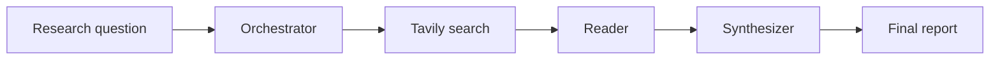

# AI Research Assistant

## Project

An interactive, multi-agent research assistant. Enter a research question and the application decomposes it into focused tasks, searches the web, summarizes source content, and synthesizes a final report.

## Architecture

The workflow is a linear LangGraph state graph. Each node receives and updates shared research state, which contains the question, generated tasks, search results, reader summaries, and final report.



Main modules:

- `main.py` collects the question, invokes the graph, and prints the report.
- `src/graph.py` connects the agents in execution order.
- `src/state.py` defines the shared state and Pydantic structured-output models.
- `Agents/orchestrator.py` creates research tasks with the Groq-hosted model.
- `Agents/searcher.py` retrieves web results through Tavily.
- `Agents/reader.py` summarizes source content with the model.
- `Agents/synthesizer.py` combines summaries into the final report.

## Technologies

- Python
- LangGraph for workflow orchestration
- LangChain and `langchain-openai` for model calls and structured outputs
- Groq's OpenAI-compatible API, using `openai/gpt-oss-20b`
- Tavily Search API for web research
- Pydantic for output schemas
- python-dotenv for loading local environment variables
- Langfuse for tracing agent and chain execution

## Install

Create a virtual environment, activate it, and install the dependencies from the project root:

```powershell
python -m venv .venv
.venv\Scripts\Activate.ps1
python -m pip install -r requirements.txt
```

For Command Prompt, activate with `.venv\Scripts\activate.bat`. On macOS or Linux, use `source .venv/bin/activate`.

## Configure `.env`

Create a `.env` file in the project root. Add the keys for Groq and Tavily, and the Langfuse credentials for tracing:

```dotenv
GROQ_API_KEY=your_groq_api_key
TAVILY_API_KEY=your_tavily_api_key
LANGFUSE_SECRET_KEY=your_langfuse_secret_key
LANGFUSE_PUBLIC_KEY=your_langfuse_public_key
LANGFUSE_HOST=https://cloud.langfuse.com
```

Use the Langfuse host for your account's region or self-hosted instance if it differs from the example. Keep `.env` private and do not commit API keys.

## Run

From the project root, run:

```powershell
python main.py
```

Enter a research question when prompted, for example: `What are the main benefits and risks of microservices architecture?`

## MCP tools

From the project root, run the MCP client with:

```powershell
python -m MCP.client
```

The client starts the stdio server as a Python module, lists the available tools, runs a local connectivity test, and performs a Tavily search. The search requires a valid `TAVILY_API_KEY` in `.env`.

## Multi-agent workflow

1. **Orchestrator:** asks the model to break the question into three to five independently researchable tasks. The response follows the `ResearchTasks` schema.
2. **Searcher:** sends each task to Tavily and stores the returned results in the shared state.
3. **Reader:** asks the model to extract a concise summary from each result's content. The response follows the `ReaderResult` schema and retains the source title and URL.
4. **Synthesizer:** provides the research question and reader summaries to the model, which returns a report following the `FinalReport` schema.
5. **CLI:** prints the resulting report. An empty question or missing final report is reported as an error by `main.py`.

## Langfuse instrumentation

The agents use Langfuse's `@observe` decorator to create named traces for the orchestrator, searcher, reader, and synthesizer. `main.py` also creates a LangChain `CallbackHandler` and passes it to `graph.invoke`, linking supported LangChain operations to the run trace.

With the Langfuse keys configured in `.env`, run the application and inspect the resulting traces in your Langfuse project. The traces help you follow execution across agents and review model and search operations. Without valid Langfuse credentials, tracing may be unavailable even when the research providers are configured.
